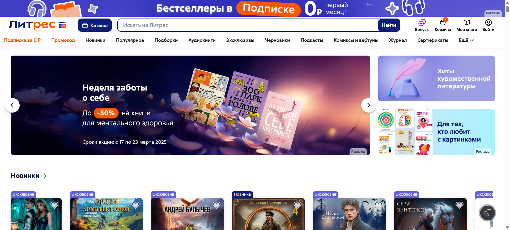
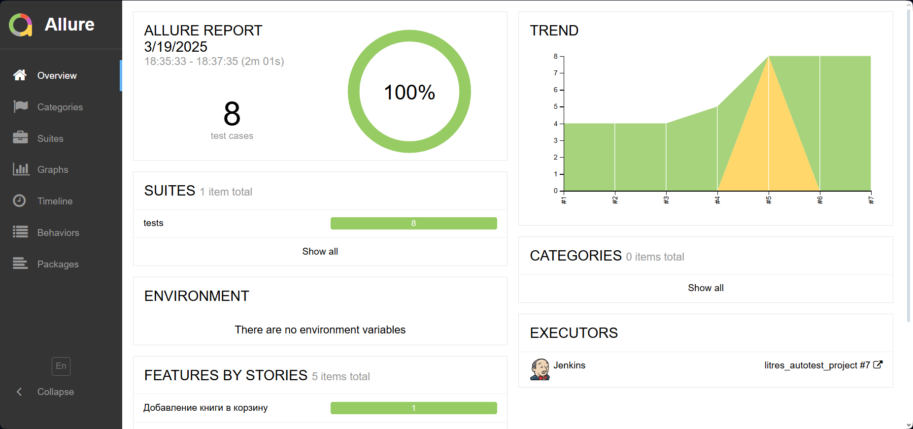
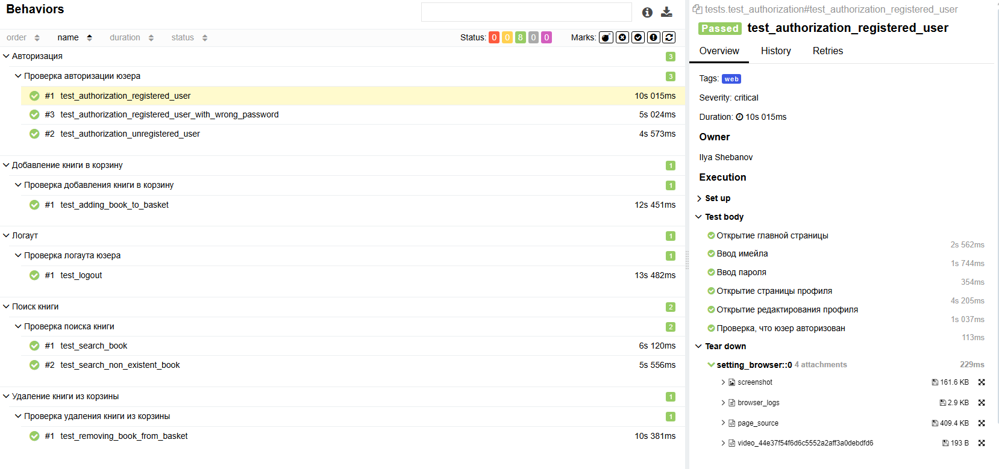
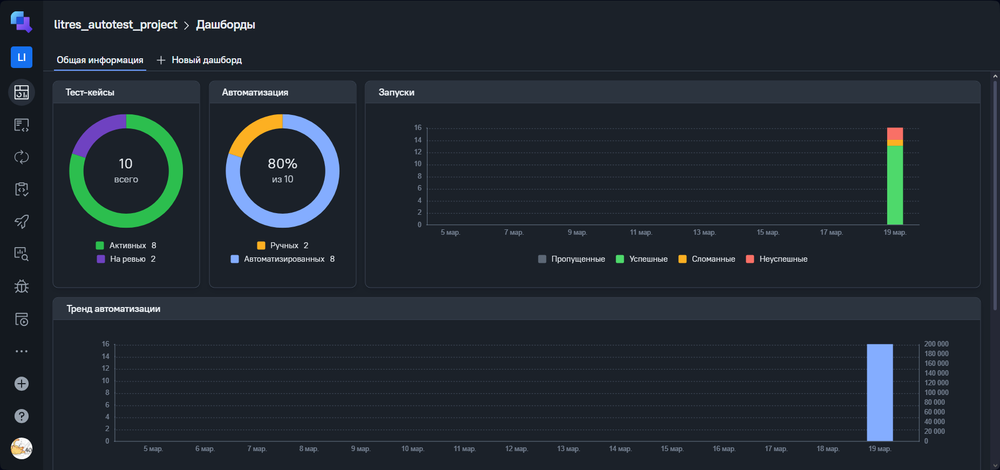
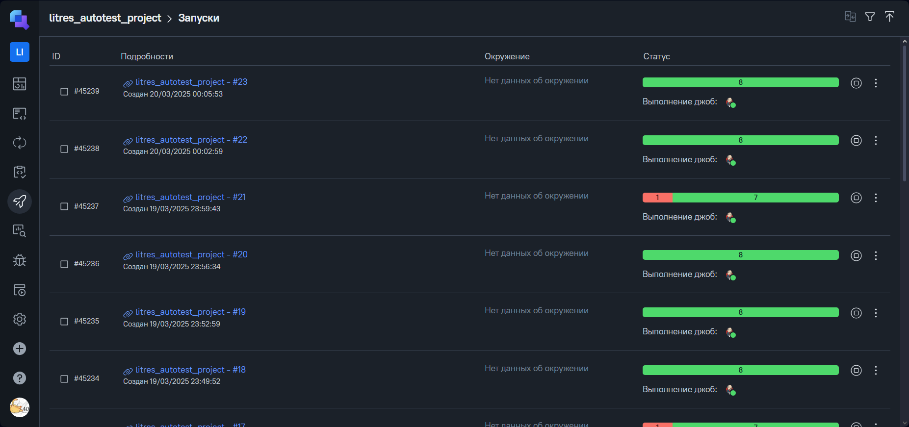
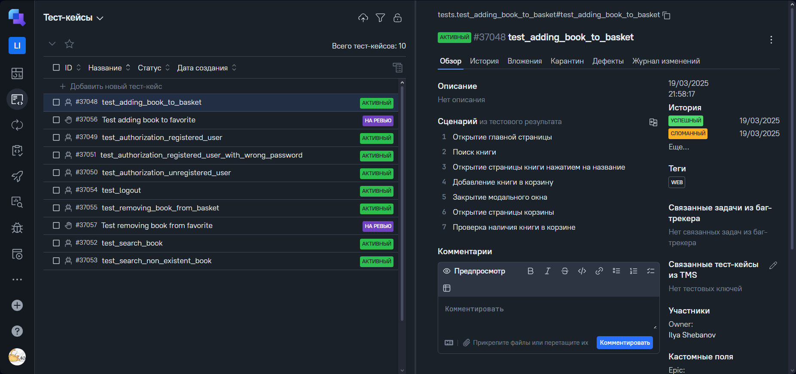
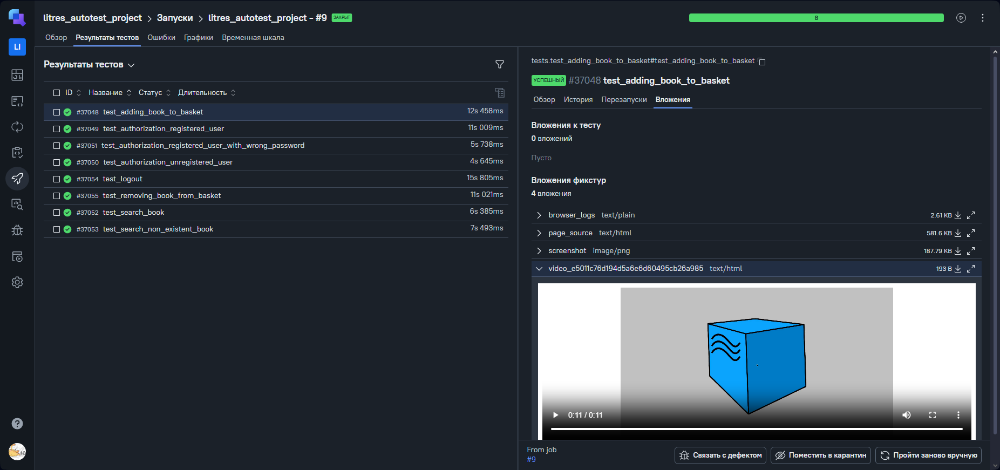
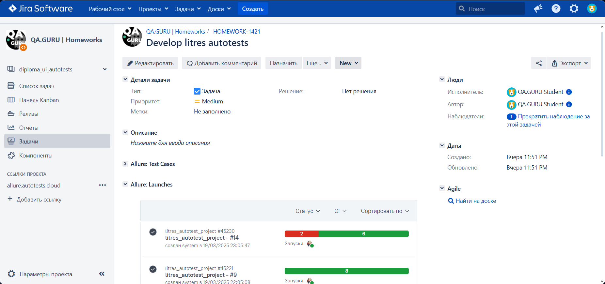
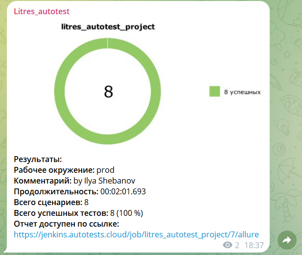
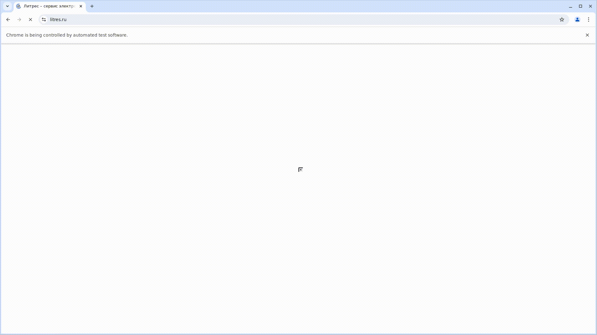

# Проект по тестированию сервиса электронных и аудиокниг "Литрес"

> [Ссылка на сайт](https://www.litres.ru)



### Список проверок, реализованных в автотестах:

### UI-тесты
- [x] Авторизация пользователя(успешная и неуспешная)
- [x] Поиск книги
- [x] Добавление книги в корзину
- [x] Удаление книги из корзины
- [x] Выход из аккаунта

----
### Проект реализован с использованием:
        

- Язык: `Python`
- Для написания UI-тестов используется фреймворк `Selene`, "обёртка" вокруг `Selenium WebDriver`
- Библиотека модульного тестирования: `PyTest`
- `Jenkins` выполняет удаленный запуск тестов.
- `Selenoid` запускает браузер с тестами в контейнерах `Docker` (и записывает видео)
- Фреймворк`Allure Report` собирает графический отчет о прохождении тестов
- После завершения тестов `Telegram Bot` отправляет в `Telegram` краткий вариант отчёта
- Полная статистика по прохождению тестов хранится в `Allure TestOps`
- Настроена интеграция `Allure TestOps` с `Jira`

----
### Локальный запуск
> Перед запуском в корне проекта создать файл .env с содержимым:
```
SELENOID_LOGIN=user1
SELENOID_PASS=1234
SELENOID_URL=selenoid.autotests.cloud

EMAIL={email of your test litres account}
PASSWORD={password of your test litres account}

UNREGISTERED_EMAIL={any unregistered email on litres}
WRONG_PASSWORD=wrongpassword
```

> Для локального запуска необходимо выполнить (ключ выбора версии --browser-version не обязателен):
```
python -m venv .venv
source .venv/bin/activate
pip install -r requirements.txt
pytest -s . --browser_version=128.0
```

----
### Удаленный запуск автотестов выполняется на сервере Jenkins
> [Ссылка на проект в Jenkins](https://jenkins.autotests.cloud/job/litres_autotest_project/)

#### Параметры сборки

- `BROWSER_VERSION` - версия браузера (браузер `Chrome`)
- `COMMENT` - комментарий


#### Для запуска автотестов в Jenkins

1. Открыть [проект](https://jenkins.autotests.cloud/job/litres_autotest_project/)
2. Выбрать пункт `Build with Parameters`
3. Указать версию браузера
4. Указать комментарий
5. Нажать кнопку `Build`
6. Результат запуска сборки можно посмотреть в отчёте Allure

----
### Allure отчет


#### Общие результаты

#### Список тест кейсов и пример отчета о прохождении теста


----
### Полная статистика хранится в Allure TestOps
> [Ссылка на проект в AllureTestOps](https://allure.autotests.cloud/project/4670/dashboards)

#### Дашборд с общими показателями тестовых прогонов



#### История запуска тестовых наборов



#### Тест кейсы



#### Тестовые артефакты



----

### Интеграция с Jira

> [Ссылка на проект в Jira](https://jira.autotests.cloud/browse/HOMEWORK-1421)



----
### Оповещение о результатах прогона тестов в Telegram
> [Ссылка на канал в Telegram](https://t.me/litres_autotest)



----
### Пример видео прохождения ui-автотеста

